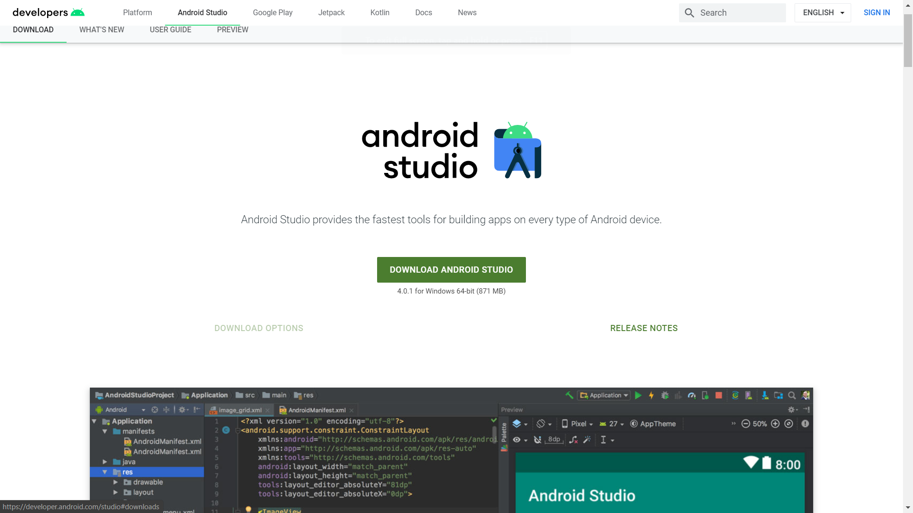
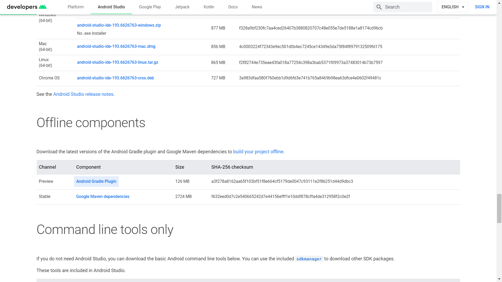
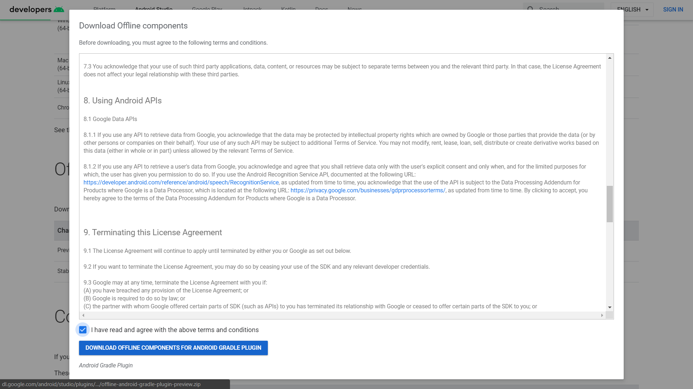
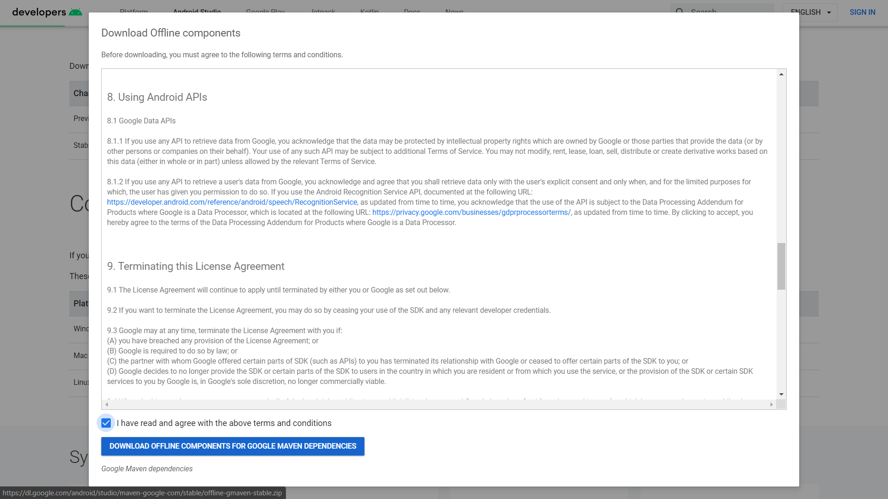
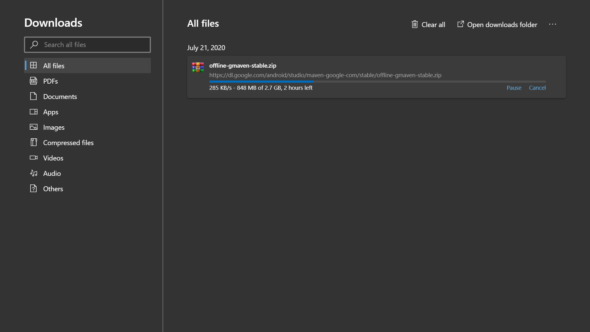
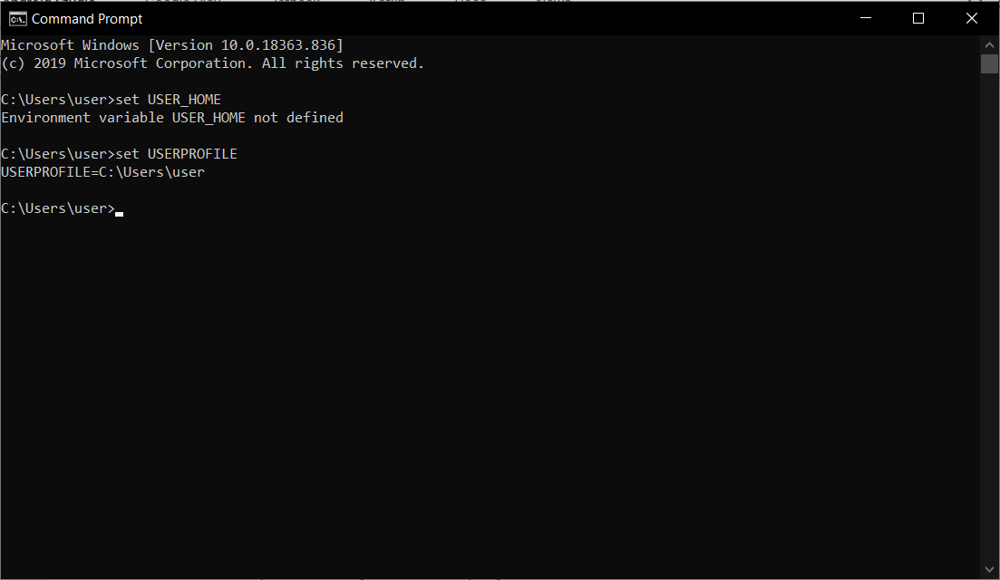
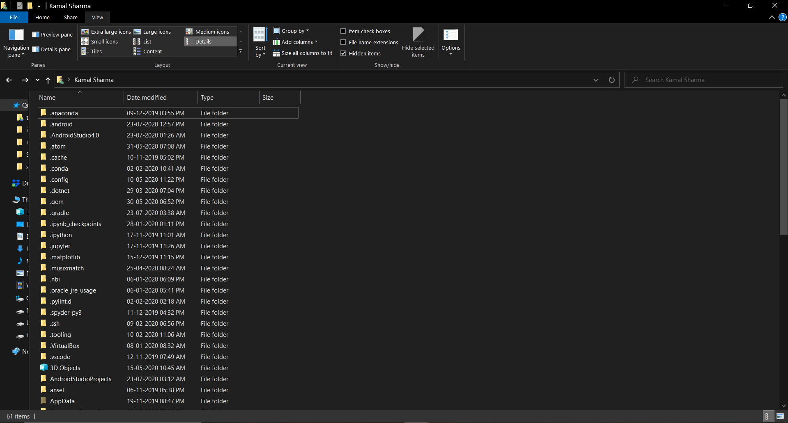
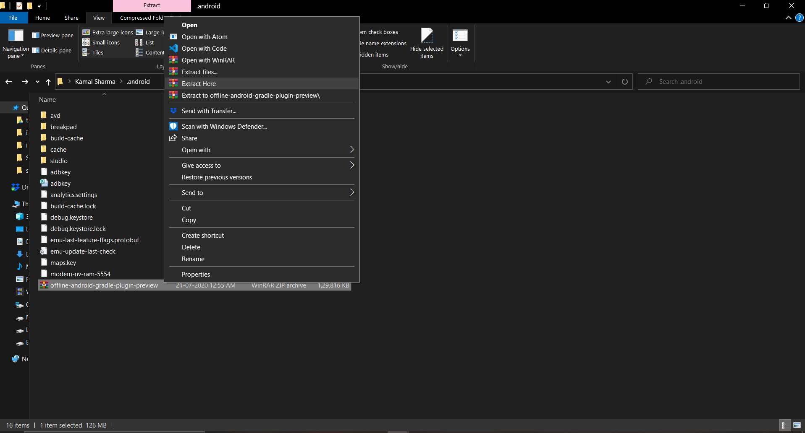
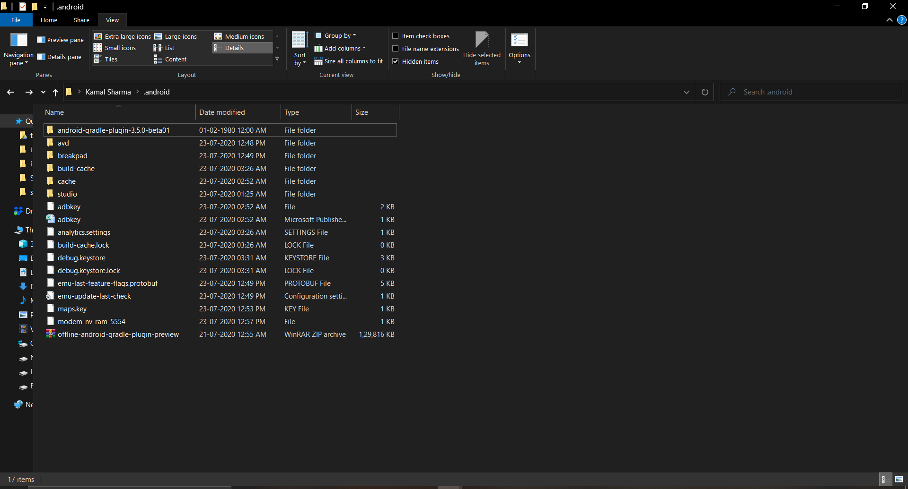
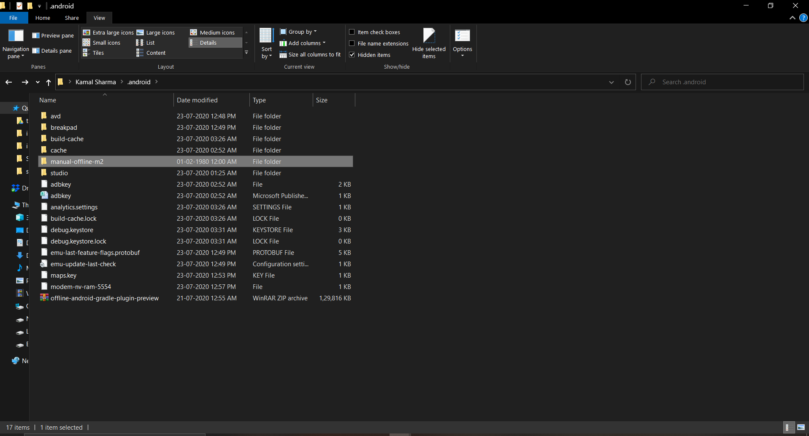

# Offline Build for Gradle and Google Maven Depndencies

Sometimes what happens is that your internet connection might be unstable or might not be there 
at all. So, build applications even though the internet is down, you need to have all the files 
required to build it offline. 

 

Even though you have a good internet connection, the build process might take a lot of time. So,
in order to make the development faster, just download all the offline components. 

 

### Step 1 - Downloading the Offline Files

Go to the download section of the offical Android website from [here](https://developer.android.com/studio).

 

Click on *DOWNLOAD OPTIONS*.

 

Click on _Android Gradle Plugin_. 

You will be seeing something like this. 

 

Accept the terms and conditions. 
Then click on the _DOWNLOAD OFFLINE COMPONENTS FOR ANDROID GRADLE PLUGIN_ button.  
A file with the name _offline-android-gradle-plugin-preview.zip_ will get downloaded.  

 

Click on _Google Maven dependencies_. 

You will be seeing something like this. 

 

Accept the terms and conditions.  
Then click on the _DOWNLOAD OFFLINE COMPONENTS FOR GOOGLE MAVEN DEPENDENCIES_ button.  
A file with the name _offline-gmaven-stable.zip_ will get downloaded.  

 

Based on your internet connection, it would take some time to download. 

 

### Step 2 - Placing the downloaded files in proper folders

#### Step 2.1

Open Command Prompt and type the following.  

        set USER_HOME

If you get a file path, then it is well and good.  
If not, type the following.  

        set USERPROFILE

 

Now, copy the file path and open it in the File Explorer.  
So, I will be opening this location in my File Explorer.  

        C:\Users\user

 

#### Step 2.2

Inside the above mentioned path, there will be many folders.   
But the ones we are concerned about now are *.gradle* and *.android* .  

Now, copy the _offline-android-gradle-plugin-preview.zip_ to *.android* folder.  
Right click on that .zip file and select _Extract Here_.  

 

Now, a folder will present itslef in *.android* folder.  

For me it is *android-gradle-plugin-3.5.0-beta01*.  
For you it may or may not be the same.  
It all depends on when you are installing it.  

 

Now, rename that folder to *manual-offline-m2* .  

So, in my case, I will be renaming *android-gradle-plugin-3.5.0-beta01* to *manual-offline-m2*.

 

 

If you still have any doubts as to how the folder is arranged, click [here](dot_android.md) to see the directory structure of *.android* folder.  

 

You may now delete the _offline-android-gradle-plugin-preview.zip_ file from _.android_ folder. 

 

##### To update the offline components, proceed as follows: 

 

1. Delete the content inside the manual-offline-m2/ directory.  
2. Re-download the offline components.  
3. Unzip the contents of the ZIP files you downloaded into the manual-offline-m2/ directory.

 

### Step 3 - Include offline components in your Gradle project

To tell the Android build system to use the offline components you've downloaded and unzipped, you need to create a script, as described below. Keep in mind, you need to create and save this script only once, even after updating your offline components.  

