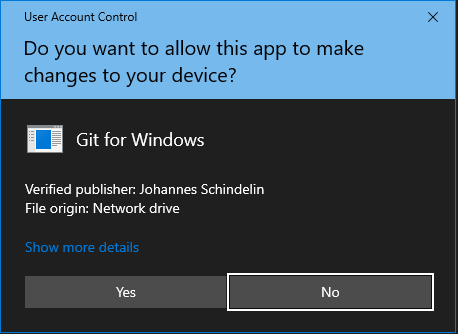

# Setup Git for Windows

### Step 1 

Download Git for Windows from the official website : https://git-scm.com/downloads
 

### Step 2 

If you do not have a specific folder for installations, then create a folder in C drive and name it anything you want. 
It is preferred if the maximum length of the folder is 8 characters. 
So, you will be installing it to the folder you just created and I am going to proceed with the folder that I have already created while installing XAMPP which is _LEO_.

So, in C drive, there is a folder with the name LEO.

          C:\LEO

 ### Step 3
 
 Click on the downloaded application. 

You might see a warning like this. 
This is just your PC trying to keep you safe. 
Just click _Yes_ or _Allow_, whatever is showing up on your PC.

### Step 4

If you had done the following steps :  
- Installed Git.
- Uninstalled Git.
- Installing it again.

Then, Only show new options would be _checked_ or _selected_, however you like to say it. 
It will look something like this :

- [x] Only show new options

Just unselect it. 
Click Next. 

### Step 5
