# Setup Instructions for XAMPP

### For Windows PC

The instructions here is for a Windows PC.  
For Linux and Mac, it will be added later.

It would be better and preferrable if you install in a specific folder rather than the default path of
C:\xampp. 

 

i) Download the Xampp application from here : https://www.apachefriends.org/index.html
    The download size is around 150MB. 

 

ii) Create a folder in C drive and name it anything you want.  
    It is preferred if the maximum length of the folder is 8 characters. 
    For example, I am going to name it LEO. 

So, in C drive, there is a folder ARCHER. 
       
       C:\LEO

 

iii) Click on the downloaded application. 
        
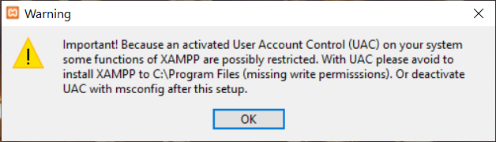

  
You might see a warning like this. This was why I told you to create the folder.  
By creating our own folder, we need not worry about the permissions mentioned in that warning box. 
Now, click OK.  

iv) Click Next 

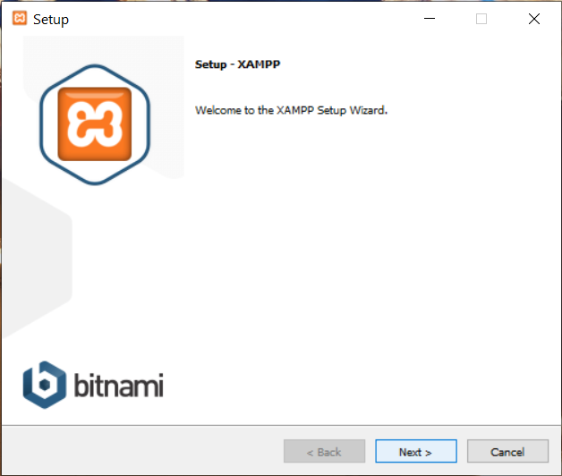

 
v) By default, it would be  

        C:\xampp
        
  Change it to   
  
        C:\LEO\xampp
   
  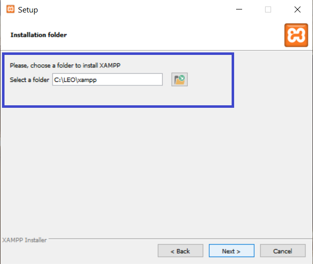
 

vi) If you want leave as it is and click next. 
But I don't want to know more about Bitnami. 
So, I am just unselecting it.  

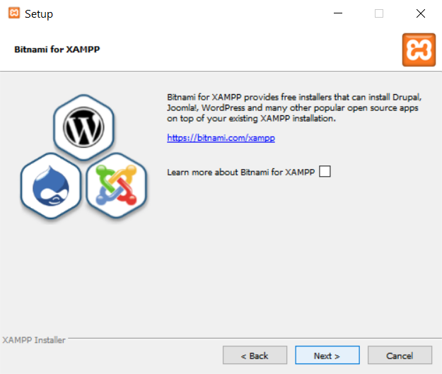

 
vii) Now, click Next. 
Just leave all the stuff as it is and let us install everything that XAMPP can provide.  
The installation will go on for 5 to 10 minutes depending on your system specifications.  

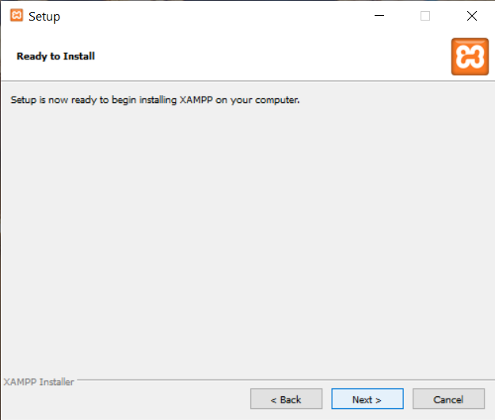

  

viii) Click Finish. 

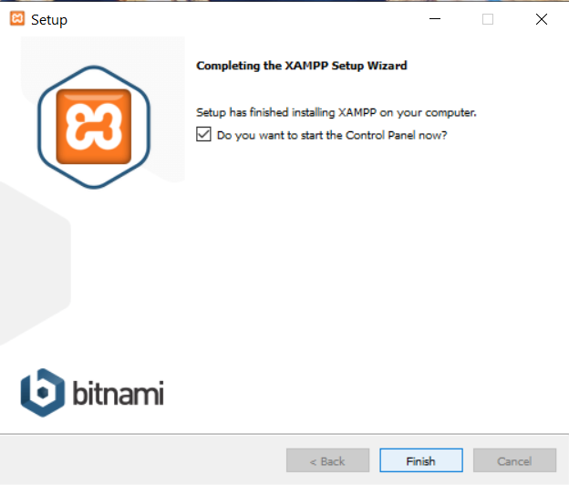

 

ix) Select English. 

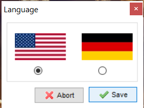

 

x) And now the Control Panel is ready.

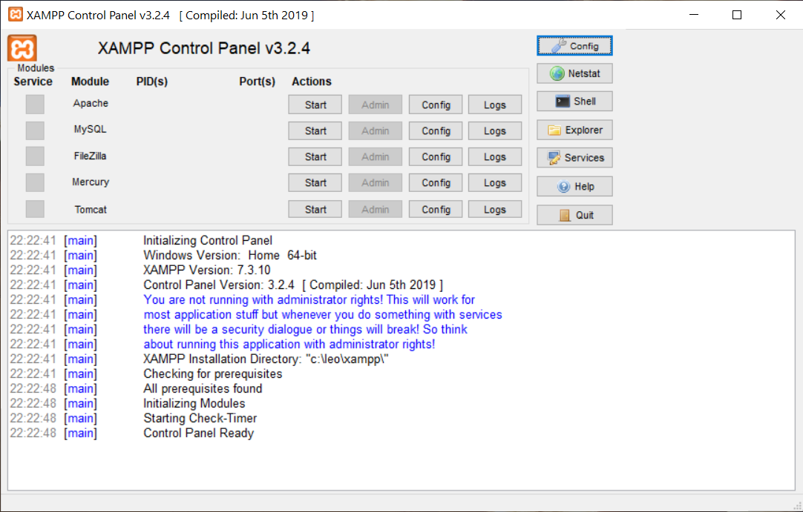

 

We will be mostly using the _Apache_ and _MySQL_ server.

 

xi) Start the Apache and MySQL servers. 
You might get some message boxes like these. 

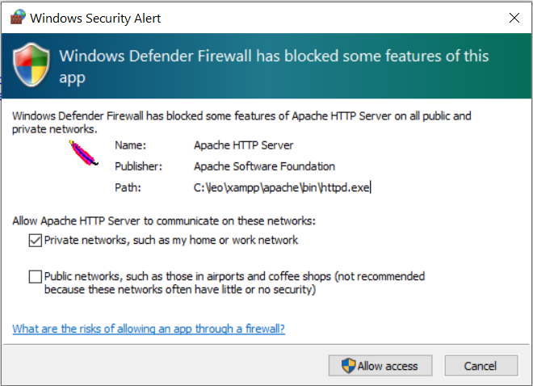

 

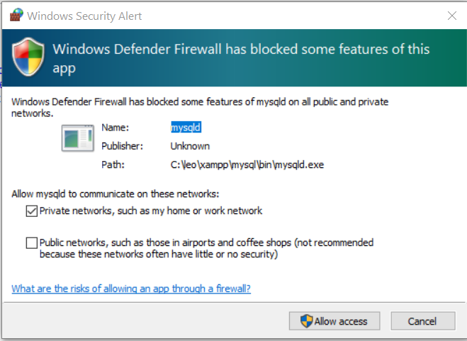

 

Just click _Allow Acess_.

Now, the _Apache_ and _MySQL_ servers are up and running.

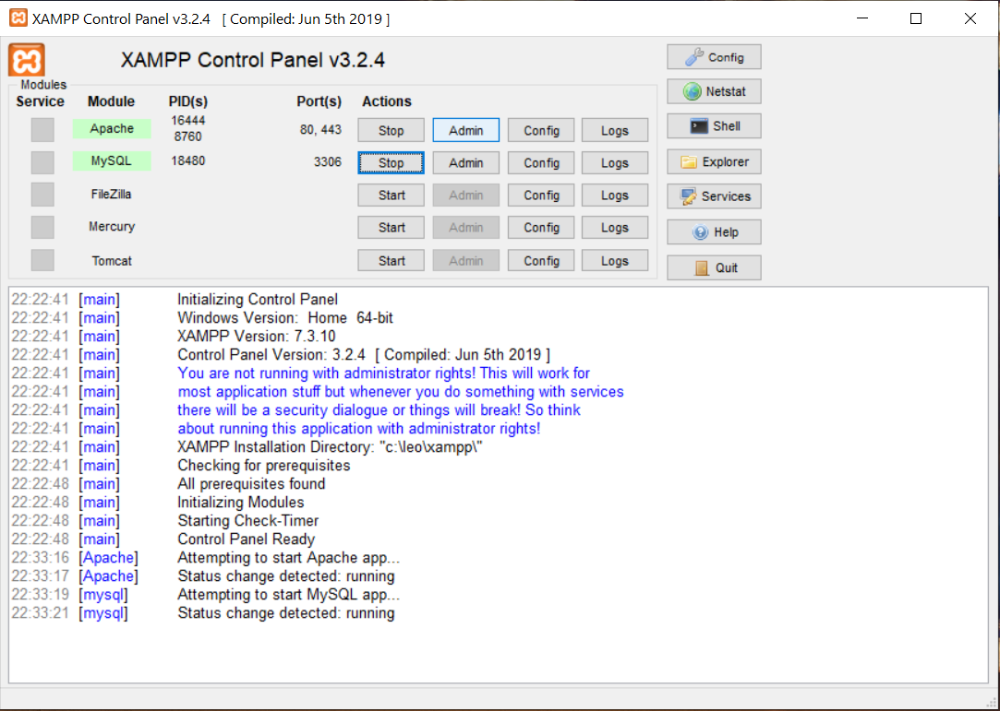
 

xii) Click on Admin of _Apache_ server.  
If all went fine, you should be seeing something like this:  

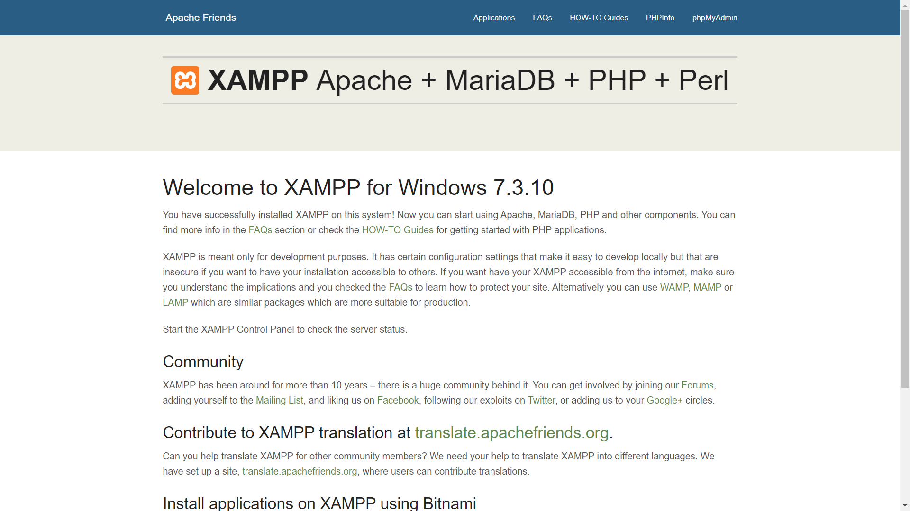

 

xii) Click on Admin of _MySQL_ server.  
You will something like this:  

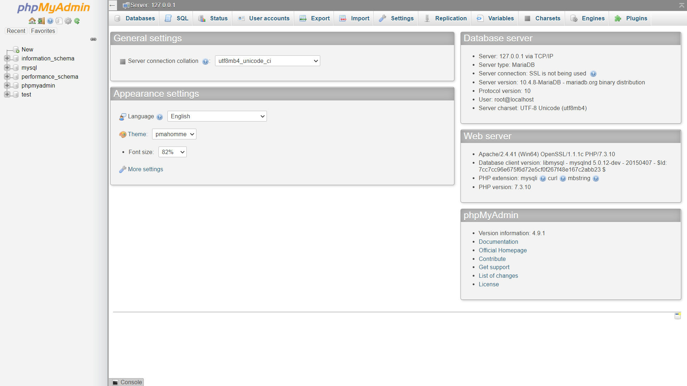

 

xiii) If one or both the servers didn't start, it might be because the same port might be used by some other application like VMWare or any other SQL servers.  
Based on experience, my advice would be not to tamper with the existing XAMPP config files.  
So, change the port number of the other applications.  
